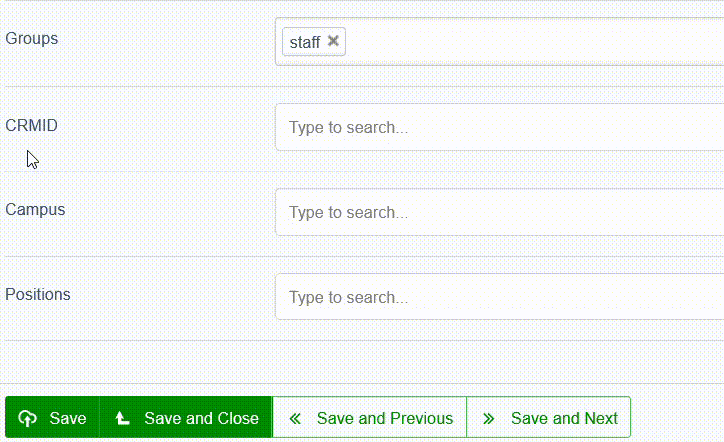

# Auto-Complete Dropdown with Custom Data



Enhance your forms with a **dynamic auto-complete dropdown** that allows for custom data sources, making it easier to integrate external APIs or custom search methods.

## Why Use This?
✅ **Flexible & Powerful** – Works with `Varchar`, `Text`, `has_one`, and even `many_many` relationships.  
✅ **Simple & Clean** – Uses closures for a neat, efficient search method without complex controllers.  
✅ **Customizable** – Supports external APIs, hardcoded arrays, and SilverStripe relationships.  

## Examples

### Using an External API (e.g., Microsoft Graph)
If you're fetching data from an external API, like Microsoft Graph, you can structure your search method as follows:

```php
// 'Team' is a Varchar field in my DataObject.
$suggestedTeam = AutocompleteSuggestField::create('Team', 'Team', function ($search) {
    $result = AzureIntegration::request(
        "https://graph.microsoft.com/beta/groups?\$filter=startswith(displayName%2C'$search')&select=description,displayName,id&\$top=10",
        'GET'
    );

    $arrayList = [];
    foreach ($result->Data()?->value as $searchResult) {
        $arrayList[] = [
            'value' => $searchResult->id,
            'label' => $searchResult->displayName,
        ];
    }
    
    return $arrayList;
}, $this->Team, 'Name');

$fields->addFieldToTab('Root.Main', $suggestedTeam);
```

### Using a Hardcoded Array (e.g., has_one Relationship)
Need a simple dropdown with predefined options? This example saves against a `Member` has_one relationship:

```php
// 'Member' is a has_one relationship
$favoriteMember = AutocompleteSuggestField::create('MemberID', 'Favorite Member', function ($search) {
    return [
        [ 'value' => 1, 'label' => 'Torleif'],
        [ 'value' => 80, 'label' => 'Alastair'],
    ];
});
```

### Using a many_many Relationship
Want multi-selection? This works with `many_many` relationships using `setIsMultiple(true)`, allowing multiple selections.

```php
$myTeam = AutocompleteSuggestField::create('Members', 'Members', function ($search) {
    return [
        [ 'value' => 1, 'label' => 'Bobby Lee'],
        [ 'value' => 80, 'label' => 'Van Halen'],
    ];
}, $this->Members())->setIsMultiple(true);
```

---

## Compatibility
- **SilverStripe 5+** – Use this package for the latest version.
- **SilverStripe 4.\*** – Use version `4.0`.
- **SilverStripe 3.\*** – Use version `3.0`.

For DataObjects in SilverStripe 5.2+, consider using the built-in [`SearchableDropdownField`](https://docs.silverstripe.org/en/5/changelogs/5.2.0/#searchable-dropdown-field) for simpler internal searches.

## Installation
Install via Composer:

```sh
composer require otago/autocomplete-suggest-field
```

## Features
- **Custom Autocomplete** – Define what data appears in the dropdown.
- **User-Friendly Labels** – Display meaningful names instead of raw database IDs.
- **CMS-Friendly** – Keeps your admin panel clean and intuitive.

## Running Tests
Ensure everything works correctly with:

```sh
vendor/silverstripe/framework/sake dev/tests/AutocompleteSuggestTest
```

---
Now you're all set to implement a **powerful and flexible** autocomplete dropdown in your SilverStripe project! 🚀

