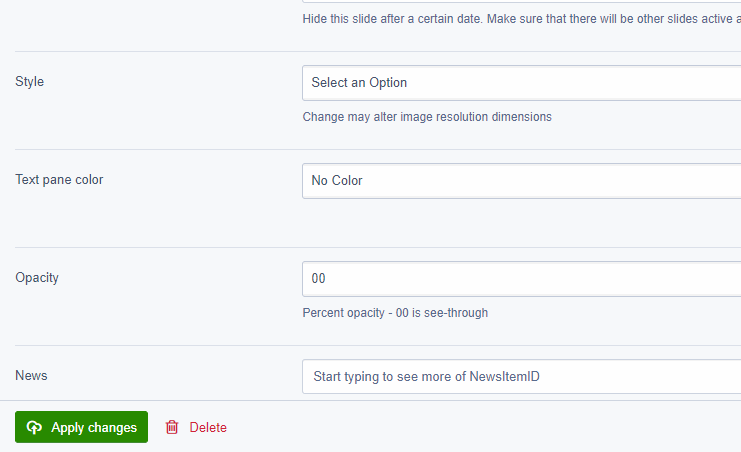

# Ajax autocomplete suggestion field for SilverStripe

Use the 3.0 version for SilverStripe 3.\*, and the 4.0 version for SilverStripe 4.\*

**Allows the user to select from a list of options while typing.** It saves an ID 
against a field; be in Int, Text etc. Some handy use 
cases would be; selecting a CSS class from a large list, selecting a user from a
remote API, or selecting a SilverStripe member when you have thousands of members.



## Installation

```composer require otago/autocomplete-suggest-field```

## Features

* **Flexible autocomplete**
  This fields lets a developer customize what goes into the autocomplete 
list. It populates an HTML5 <datalist> element that lets the user select an 
option via AJAX. To build an ajax list, create an action against the provided 
controller with the name autocomplete<name of your field>. It takes a GET 
parameter <query>, and outputs a json array with the format id:etc, name:etc. 
* **Friendly display names**
  You can have a $has_one or $db living on a DataObject or Page, and display a 
friendly name instead of an ugly ID. This makes your code base tidier, lets you 
forget about having to force a many_many when you don't really need it, 
and allows your cms admins to not hate your face.
* **Frontend and backend compatible**
  the only requirement is jQuery. No entwine needed.

##### expose the JS files

```composer vendor-expose```

## Tests

```vendor/silverstripe/framework/sake dev/tests/AutocompleteSuggestTest```

## Support

[All modern browsers support this feature.](https://caniuse.com/#feat=datalist). older MSIE versions do not work

## Basic example

The following will create a search field in the CMS. Note the logged in user has to have access to the Member object. Searching logic is handled by a controller which comes out the box with autocomplete-suggest-field.

```php
<?php

use OP\AutocompleteSuggestField;
use SilverStripe\Security\Member;

class MyFavouriteUserPage extends Page {

	private static $has_one = array(
		'FavouriteUser' => Member::class
	);
	public function getCMSFields() {
		$fields = parent::getCMSFields();

		$suggesteduser = AutocompleteSuggestField::create('FavouriteUserID', Member::class);
		$suggesteduser->setDescription('Enter text to search for your favourite user');
		$fields->addFieldToTab('Root.Main', $suggesteduser);

		return $fields;
	}

}

```

## custom search examples

Below shows how a developer can create custom search queries on the same file to return results

```php
<?php

use OP\AutocompleteSuggestField;
use SilverStripe\CMS\Controllers\ModelAsController;
use SilverStripe\Control\HTTPRequest;
use SilverStripe\View\Requirements;
use SilverStripe\Security\Member;


class MyFavouriteUserPage extends Page {

	private static $has_one = array(
		'FavouriteUser' => Member::class
	);
	public function getCMSFields() {
		$fields = parent::getCMSFields();

		$suggesteduser = AutocompleteSuggestField::create('FavouriteUserID', ModelAsController::controller_for($this), 'Favourite user', null, $this);
		$suggesteduser->setDescription('Enter text to search for your favourite user');
		$fields->addFieldToTab('Root.Main', $suggesteduser);

		return $fields;
	}

}

class MyFavouriteUserPageController extends PageController {

	private static $allowed_actions = array(
		'autocompleteFavouriteUserID',
	);

	/**
	 * searches users in the local db
	 * @param SS_HTTPRequest $httprequest
	 */
	public function autocompleteFavouriteUserID(HTTPRequest $httprequest) {
		Requirements::clear();
		$query = $httprequest->getVar('query');
		$returnarray = array();

		if ($query && strlen($query) > 1) {
			$name = explode(' ', $query);

			$members = array();
			if (count($name) === 1) {
				$members = Member::get()->filter(array('FirstName:StartsWith:nocase' => $name[0]))->limit(10);
			}
			if (count($name) > 1) {
				$members = Member::get()->filter(array('FirstName:StartsWith:nocase' => $name[0], 'Surname:StartsWith:nocase' => $name[1]))->limit(10);
			}

			foreach ($members as $member) {
				$returnarray[] = array('id' => $member->ID, 'name' => $member->getName());
			}
		}

		print_r(json_encode($returnarray));
	}

}
```

## A more complicated example that pulls in data from an external API

Note the office365 object does the actualy Ajax + parsing of the data

```php
class TeamPage_Controller extends Page_Controller {

	private static $allowed_actions = array(
		'autocompleteTeam'
	);

	/**
	 * used to autocomplete the teams on office 365
	 * @param SS_HTTPRequest $httprequest
	 */
	public function autocompleteTeam(SS_HTTPRequest $httprequest) {
		Requirements::clear();
		$query = $httprequest->getVar('query');
		$returnarray = array();

		if ($query && strlen($query) > 1) {
			$searchresult = office365::searchForTeam(urlencode($query));
			foreach ($searchresult->value as $team) {
				$returnarray[] = array('id' => $team->id, 'name' => $team->displayName . ' (' . $team->description . ')');
			}
		}

		print_r(json_encode($returnarray));
	}
}
```
